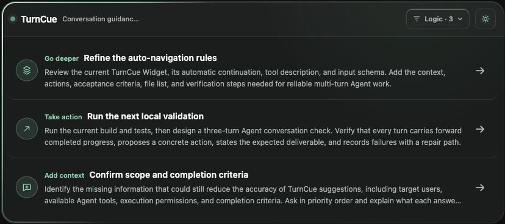
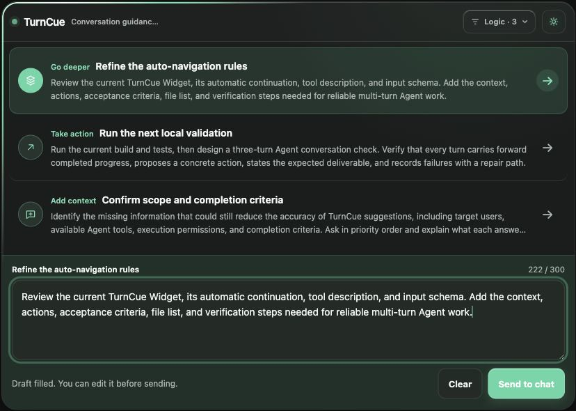

# TurnCue

[中文](./README.md) | [English](./README.en.md)

TurnCue is a local conversation-navigation plugin for the Codex desktop app. After each completed answer, it adds an MCP Widget with 3–5 editable directions for the next turn.

The public product name is **TurnCue**. The plugin, Marketplace, and MCP technical IDs remain `conversation-navigator` so existing installations, configuration, and automation keep working.



## Features

- Shows the suggestion card after the main answer completes.
- Supports Auto, Chinese, and English language modes.
- Includes Brainstorm, Rational, and Empathic navigation personalities.
- Generates 3, 4, or 5 suggestions per turn.
- Gives every suggestion a current objective, a concrete action, and a verifiable deliverable.
- Opens an editable draft on single click and sends it back to the current task.
- Runs the Hook, MCP server, and Widget locally, with no public endpoint, OAuth, OpenAI API key, or additional database.

## Language and personality

The preference menu in the Widget offers three language modes:

- **Auto**: follows the language of the latest substantive user request, then falls back to the Codex host locale when the language is unclear.
- **中文**: keeps subsequent suggestions in Chinese.
- **English**: keeps subsequent suggestions in English.

Changing the language updates fixed Widget labels immediately and affects newly generated suggestions from the next turn onward. Existing suggestions are not translated automatically.

The three personalities keep stable technical IDs across both languages:

- **Brainstorm / 创意脑暴** (`brainstorm`): favors divergence, unexpected connections, and clearly distinct creative paths.
- **Rational / 理性推演** (`rational`): favors evidence, constraints, risks, priorities, and verification.
- **Empathic / 感性共鸣** (`empathic`): favors audience response, emotion, narrative tone, and aesthetic experience.

## Execution order

```text
Codex completes the answer → Stop Hook fires → TurnCue continuation calls show_next_steps → Widget appears below the answer
```

This order has been verified end to end on macOS with the Codex app bundled CLI `0.146.0-alpha.9.2`: the main `agent_message` completed before the `conversation-navigator/show_next_steps` tool call appeared.

The model performs the automatic tool call, so this is a high-recall design rather than a 100% guarantee. If the model misses the call, input validation fails, or the MCP server is unavailable, say “Show next steps,” “Refresh next-step suggestions,” or “显示建议卡片.”

## Installation

Requirements:

- The Codex desktop app; plugin management commands require a Codex CLI build with plugin support.
- Node.js 22.13 or newer.
- The current release is verified on macOS. Windows has not been verified.

Check the environment first:

```bash
codex --version
node --version
```

Then install the Marketplace and plugin:

```bash
codex plugin marketplace add xuhuawork/conversation-navigator
codex plugin add conversation-navigator@conversation-navigator
```

After installation:

1. Quit Codex completely and reopen it.
2. Open `/hooks` in Codex.
3. Verify the command is `node "${PLUGIN_ROOT}/scripts/auto-navigation-stop-hook.mjs"`.
4. Trust and enable the Hook whose status reads “TurnCue 正在整理下一步 / Preparing next steps…”.
5. Start a new task and ask a normal question. The suggestion card should appear after the answer completes.

Installing or enabling a plugin does not automatically trust its Hook. When an update changes the Hook definition, Codex asks you to review and trust it again.

You do not need to say “Start TurnCue” before normal use. That phrase is useful for first-run verification, and the manual commands provide a recovery path if automatic invocation is missed.

## Quick verification

Confirm that the plugin is enabled:

```bash
codex plugin list --json
```

Then start a new task and run this sequence:

1. Send “First-turn test: introduce TurnCue in one sentence.”
2. Confirm that the full answer appears before a card with 3 suggestions.
3. Single-click a suggestion, edit the draft, and select “Send to conversation.”
4. Change the language to English, the personality to Brainstorm, and the count to 5.
5. After the next answer completes, confirm that the new card contains 5 English suggestions.
6. Change to Chinese, Empathic, and 4 suggestions, then confirm that the following card contains 4 Chinese suggestions.
7. Return to Auto and alternate between Chinese and English requests. Confirm that suggestions follow the latest substantive request.

Double-clicking a suggestion sends it immediately without first stopping in the editor.



## Usage

- Single click: place a suggestion in the Widget editor before sending.
- Double click: send the suggestion immediately.
- `Command/Ctrl + Enter`: send the current draft.
- Appearance menu: follow the system, use light or dark mode, and choose an accent color.
- Preference menu: choose the language, personality, and 3–5 suggestions per turn.

Preferences are passed through the current task's model context and take effect on the next generation. The current release does not persist global preferences across tasks.

## Updating

```bash
codex plugin marketplace upgrade conversation-navigator
codex plugin remove conversation-navigator@conversation-navigator
codex plugin add conversation-navigator@conversation-navigator
```

After updating:

1. Quit Codex completely and reopen it.
2. Open `/hooks`, verify the TurnCue command, and trust the current definition.
3. Test in a new task. Existing tasks may retain an older MCP, tool, or Widget snapshot.

## Disabling and uninstalling

- Pause automatic cards by disabling the TurnCue Stop Hook in `/hooks`.
- Remove the plugin:

  ```bash
  codex plugin remove conversation-navigator@conversation-navigator
  ```

- If you no longer use any plugin from this repository, remove the Marketplace as well:

  ```bash
  codex plugin marketplace remove conversation-navigator
  ```

The Hook setting is global. The current release does not provide a per-task enable switch.

## Troubleshooting

1. Run `codex plugin list` and confirm that `conversation-navigator@conversation-navigator` is enabled.
2. Open `/hooks` and confirm that the TurnCue Hook is trusted and enabled.
3. Restart Codex completely and test in a new task.
4. Say “Show next steps” or “显示建议卡片.” If the card appears manually, the MCP server is usually healthy and the problem is in Hook trust or automatic invocation.
5. Confirm that `node --version` meets the requirement.
6. If an update still shows the old UI, repeat the update flow and verify that the new task reads `widget-v16.html`.

## Privacy and data boundaries

- The Widget CSP has an empty external-domain allowlist.
- The Widget does not load remote scripts, images, or fonts, and it does not initiate network requests.
- The MCP server runs locally over stdio. The Stop Hook processes the event supplied by Codex in memory; it does not read the transcript file or write a conversation database.
- The plugin stores no user profile, API key, or telemetry.
- Current task content, suggestion generation, language-preference synchronization, and drafts sent from the Widget still pass through the Codex host and current model under the user's existing Codex data settings.

Report security issues privately as described in [SECURITY.md](./SECURITY.md).

## Known limitations

- Automatic navigation adds one model continuation, with a small latency and token cost.
- Model-driven tool invocation cannot guarantee a card on every turn.
- The Hook runs after every non-empty answer, so a simple confirmation or status message may also receive suggestions.
- The Stop Hook is global, and multiple matching Stop Hooks may run at the same time.
- Drafts, appearance, and navigation preferences do not persist across tasks and may reset after reload or restart.
- Auto language detection can choose incorrectly in heavily mixed Chinese-English requests; select a language manually to override it.
- Existing tasks may keep older tool or Widget snapshots.
- Windows has not been verified.

## Development

```bash
npm ci
npm run validate
```

`npm run build:plugin` synchronizes both READMEs, the Widget, and the Hook, then bundles the MCP server and runtime dependencies into `plugins/conversation-navigator/mcp/server.mjs`. Plugin users do not need to build the bundle or run `npm install`.

Repository layout:

```text
.agents/plugins/marketplace.json       Codex Marketplace
mcp/                                   MCP and Widget sources
scripts/                               Hook and plugin build scripts
plugins/conversation-navigator/        Installable plugin package
tests/                                 Hook, resource, and tool contract tests
```

## Compatibility scope

Automatic post-answer cards depend on the Codex `Stop` lifecycle Hook. A general ChatGPT MCP App can reuse the Widget and `show_next_steps` tool after adding a Streamable HTTP MCP deployment, but it cannot use the same per-turn Codex Stop Hook. This repository cannot be installed directly as a ChatGPT App.

## License

[MIT](./LICENSE). See [THIRD_PARTY_NOTICES.md](./THIRD_PARTY_NOTICES.md) for bundled dependency licenses.
