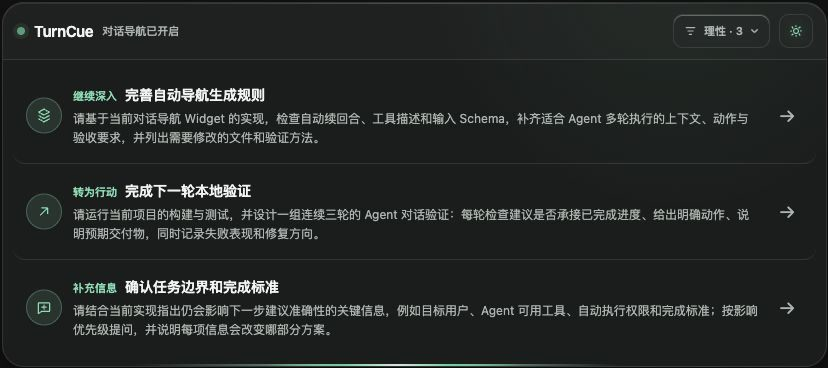
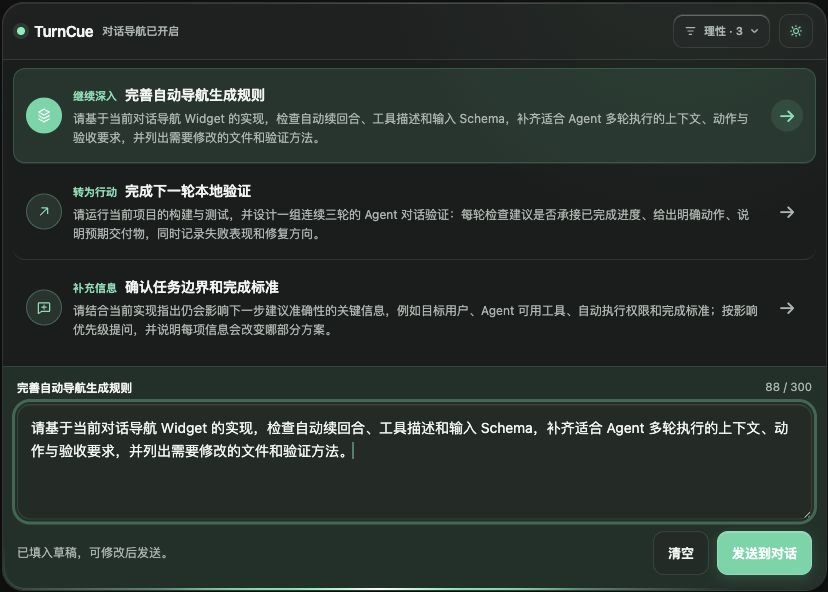

# TurnCue

[中文](./README.md) | [English](./README.en.md)

TurnCue 是面向 Codex 桌面 App 的本地对话导航插件。它通过 MCP Widget 按需提供 3–5 个可编辑的下一步方向，支持模型根据对话调用，也支持用户手动输入“显示建议卡片”。

公开品牌为 **TurnCue**，插件、Marketplace 与 MCP 的技术 ID 统一为 `turncue`。



## 功能

- 根据模型判断或手动指令显示建议卡片。
- 支持自动、中文和 English 三种语言设置。
- 支持创意脑暴、理性推演、感性共鸣三种导航人格。
- 每轮可选择 3、4 或 5 个建议。
- 每条建议包含当前目标、具体动作和可验证交付物。
- 单击建议后展开编辑框；修改后可以发送回当前任务。
- MCP 服务、Widget 与可选的 SessionStart observer 在本机运行，无需公网地址、OAuth、OpenAI API Key 或额外数据库。
- 安全模式不使用 `Stop` block；observer 只观察生命周期事件，不向任务写回内容，也不启动模型续回合。

## 语言与人格

Widget 右上角的偏好菜单提供三种语言设置：

- **自动**：优先跟随最近一条实质用户请求的语言；无法判断时使用 Codex 主机语言。
- **中文**：后续建议固定使用中文。
- **English**：后续建议固定使用英文。

语言切换会立即更新 Widget 的固定界面文案，并从下一轮开始影响新建议。已经生成的建议不会被自动翻译。

三种人格使用稳定的技术 ID，切换语言不会改变现有配置：

- **创意脑暴 / Brainstorm** (`brainstorm`)：强调发散、意外联系和明显不同的创意路径。
- **理性推演 / Rational** (`rational`)：强调事实、约束、风险、优先级和验证。
- **感性共鸣 / Empathic** (`empathic`)：强调受众感受、情绪、叙事语气和审美体验。

## 安全模式与工作顺序

```text
模型判断或用户手动请求 → turncue/show_next_steps → 显示 Widget
SessionStart → 启动本地 observer → 只观察事件，不写回任务
```

旧版曾使用 `Stop` block 请求模型续回合。该机制会把 Hook reason 作为新的用户提示交给模型，可能延长或打断原始任务，因此安全模式已移除这条自动续写链路。

普通 Codex Desktop 目前没有公开的接口，允许插件 observer 连接到桌面 App 正在使用的同一个 App Server，并在每个已完成回合后静默追加 Widget。因此 TurnCue 不承诺每轮都在正文底部自动出现卡片。模型漏调、参数校验失败或 MCP 未加载时，可以输入“显示建议卡片”“刷新下一步建议”或 “Show next steps”。

## 安装

要求：

- Codex 桌面 App；插件管理命令由带插件功能的 Codex CLI 提供。
- Node.js 22.13 或更高版本。
- 当前版本已在 macOS 验证；Windows 尚未验证。

先检查环境：

```bash
codex --version
node --version
```

然后安装 Marketplace 与插件：

```bash
codex plugin marketplace add xuhuawork/turncue
codex plugin add turncue@turncue
```

安装后：

1. 完全退出并重新打开 Codex。
2. 运行 `codex plugin list --json`，确认插件已启用。
3. 新建一个任务，输入“显示建议卡片”验证 MCP 与 Widget。
4. 如需 observer 诊断，在 `/hooks` 中审阅并启用 TurnCue 的 `SessionStart` Hook。它只观察事件，不会自动发送消息或生成建议卡片。

安装或启用插件不会自动信任其中的 Hook。更新后的 `SessionStart` Hook 定义发生变化时，也需要重新审阅和信任。无需 observer 时可以保持停用，手动和模型驱动的 `show_next_steps` 仍可使用。

无需先说“开启 TurnCue”。手动入口是稳定的验收与恢复方式；也可以在任务中要求模型在合适的实质回答后调用 `show_next_steps`。

## 从旧版 `conversation-navigator` 迁移

如果曾安装旧技术 ID，请先移除旧插件和旧 Marketplace，再安装 TurnCue。不要同时保留两套安装，否则可能重复注册 MCP 服务或 Hook。

```bash
codex plugin remove conversation-navigator@conversation-navigator
codex plugin marketplace remove conversation-navigator
codex plugin marketplace add xuhuawork/turncue
codex plugin add turncue@turncue
```

迁移后完全退出并重新打开 Codex，在 `/hooks` 中停用仍指向旧 `conversation-navigator` 安装路径的 Hook，然后新建任务输入“显示建议卡片”。旧缓存或 Hook 信任记录可以保留为失效记录，但不应继续启用。

## 快速验收

先确认插件已启用：

```bash
codex plugin list --json
```

新建任务后依次测试：

1. 发送“显示建议卡片，请给我 3 个测试 TurnCue 的下一步方向。”
2. 确认出现包含 3 条建议的 Widget。
3. 单击一条建议，修改草稿，再点击“发送到对话”。
4. 把语言切到 English、人格切到 Brainstorm、数量切到 5，然后再次输入 “Show next steps”。
5. 确认新卡片包含 5 条英文建议。
6. 再切到中文、感性共鸣和 4 条，输入“刷新下一步建议”，确认出现 4 条中文建议。
7. 发送一个不要求导航的普通任务，确认原始任务完整运行，且没有 `Stop` Hook 自动插入的续回合。

双击建议会立即发送，不会先停留在编辑框中。



## 使用

- 单击建议：填入 Widget 编辑框，允许修改后发送。
- 双击建议：立即发送原建议。
- `Command/Ctrl + Enter`：发送当前草稿。
- 外观菜单：跟随系统、浅色或深色，并可选择强调色。
- 偏好菜单：选择语言、人格和每轮 3–5 条建议。
- 手动入口：输入“显示建议卡片”“刷新下一步建议”或 “Show next steps”。

偏好通过当前任务的模型上下文传递，从下一轮生成开始生效。当前版本没有跨任务的全局偏好保存。

## 更新

```bash
codex plugin marketplace upgrade turncue
codex plugin remove turncue@turncue
codex plugin add turncue@turncue
```

更新后：

1. 完全退出并重新打开 Codex。
2. 打开 `/hooks`，确认没有启用旧版 TurnCue `Stop` Hook；如需 observer，再审阅当前 `SessionStart` Hook。
3. 新建任务并用“显示建议卡片”测试。旧任务可能保留更新前的 MCP、工具或 Widget 快照。

## 停用与卸载

- 停止生命周期观察：在 `/hooks` 中停用 TurnCue 的 `SessionStart` observer。MCP 与手动卡片仍可继续使用。
- 移除插件：

  ```bash
  codex plugin remove turncue@turncue
  ```

- 如果以后不再使用这个仓库提供的任何插件，可继续移除 Marketplace：

  ```bash
  codex plugin marketplace remove turncue
  ```

`SessionStart` observer 的启用或停用是全局设置，当前没有逐任务开关。

## 故障排查

1. 运行 `codex plugin list`，确认 `turncue@turncue` 为 enabled。
2. 完全重启 Codex，再新建任务。
3. 输入“显示建议卡片”或 “Show next steps”。能手动显示通常说明 MCP 与 Widget 正常。
4. 如果任务仍被自动续回合打断，打开 `/hooks` 停用所有指向 `auto-navigation-stop-hook.mjs` 的旧版 TurnCue `Stop` Hook，然后重新安装插件并新建任务。
5. 检查 `node --version` 是否满足要求。
6. 更新后仍显示旧界面时，重新执行更新流程，并确认新任务读取 `widget-v16.html`。

## 隐私与数据边界

- Widget 的 CSP 外部域名白名单为空。
- Widget 不加载外链脚本、图片、字体，也不主动发起网络请求。
- MCP 服务在本机通过 stdio 运行；可选的 SessionStart observer 只观察生命周期事件，不向任务注入内容、不调用模型续回合，也不写入对话数据库。
- 插件不保存用户画像、API Key 或遥测数据。
- 当前任务内容、建议生成、语言偏好同步以及发送后的草稿仍会经过 Codex 主机和当前模型，并遵循用户现有的 Codex 数据设置。

安全问题请按 [SECURITY.md](./SECURITY.md) 私密报告。

## 已知限制

- 模型驱动的工具调用无法保证每轮 100% 命中，手动入口更稳定。
- 普通 Codex Desktop 没有向插件公开当前桌面 App 所用 App Server 的同实例接入点，因此 observer 无法在每轮完成后静默追加卡片。
- SessionStart observer 只提供观察能力，不会触发 `show_next_steps`。
- 草稿、外观和导航偏好目前不会跨任务持久保存，重载或重启后可能恢复默认值。
- 自动语言判断在高度混合的中英文请求中可能选择错误，可用手动语言设置覆盖。
- 旧任务可能保留安装前的工具或 Widget 快照。
- Windows 尚未验证。

## 开发

```bash
npm ci
npm run validate
```

`npm run build:plugin` 会同步中英文 README、Widget 与 observer 文件，并将 MCP 服务及运行依赖打包到 `plugins/turncue/mcp/server.mjs`。安装用户无需执行构建或 `npm install`。

目录结构：

```text
.agents/plugins/marketplace.json       Codex Marketplace
mcp/                                   MCP 与 Widget 源码
scripts/                               observer 与插件构建脚本
plugins/turncue/                       可直接安装的插件包
tests/                                 observer、资源和工具契约测试
```

## 兼容范围

Codex Desktop 版本通过本地 stdio MCP 提供 Widget 和 `show_next_steps`。安全模式不使用 `Stop` block；SessionStart observer 也不会写回任务。通用 ChatGPT MCP App 可以复用 Widget 与工具，但需要额外部署 Streamable HTTP MCP 服务。当前仓库不能直接作为 ChatGPT App 安装，也不承诺逐轮自动追加卡片。

## License

[MIT](./LICENSE)。打包依赖的许可证见 [THIRD_PARTY_NOTICES.md](./THIRD_PARTY_NOTICES.md)。
